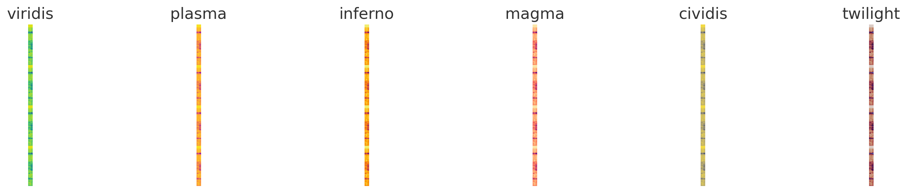

# Image Processing API

This Python project provides an API for managing and processing image data stored in a CSV format. It includes
functionalities for resizing images, applying color maps, and retrieving image data based on specified depth ranges.

## Project Description

The project tackles the challenge of processing image data described as follows:

- The image data is provided in a CSV file with each row containing pixel values and a corresponding depth value
  indicating the image slice's depth.
- The image width needs to be resized from 200 pixels to 150 pixels.
- Resized images are then stored in a database.
- The API allows querying image data by specifying minimum and maximum depth values.
- A custom color map is applied to enhance the visual output of the images retrieved via the API.

## Assumptions

The following assumptions were made to guide the development of the API:

1. **Data Format**: The primary data format is CSV, where each row corresponds to an image slice with pixel values and a
   depth indicator.
2. **Image Processing**: The resizing of images is necessary to meet specific width requirements and optimize data
   storage and retrieval.
3. **API Functionality**: Users can fetch images based on depth criteria, and the images are processed on-the-fly to
   apply a predefined color map before delivery.
4. **Storage**: Processed images are stored in a binary format in a relational database (postgreSQL) to facilitate easy retrieval
   based on depth queries.

# Image Colormaps

This document demonstrates the application of various color maps to a single image using Matplotlib. Below is the composite image showing the original image transformed with six different color maps.



The following color maps were used, from left to right:
1. **viridis**
2. **plasma**
3. **inferno**
4. **magma**
5. **cividis**
6. **twilight**

Each c
## Setup and Installation

### Prerequisites

- Docker
- Docker Compose

### Building and Running with Docker Compose

1. **Clone the Repository**:
   ```bash
   git clone https://github.com/Ameenkp/image-resizer-api.git
   
    cd image-resize-api
    ```
2. **Build the Docker Image**:
    ```bash
    docker-compose build 
    ```
3. **Run the Docker Container**:
    ```bash
    docker-compose up
    ```
   
4. **Access the API**:
    The API specs/docs are published using Postman.
    The API is accessible at `https://documenter.getpostman.com/view/31106366/2sA3JRYe5V`.